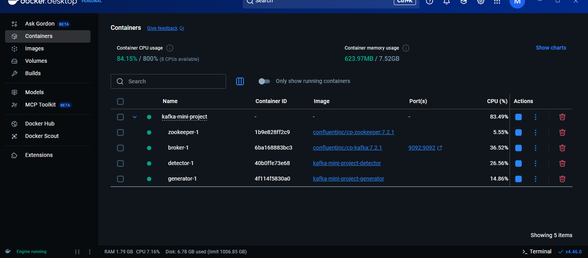
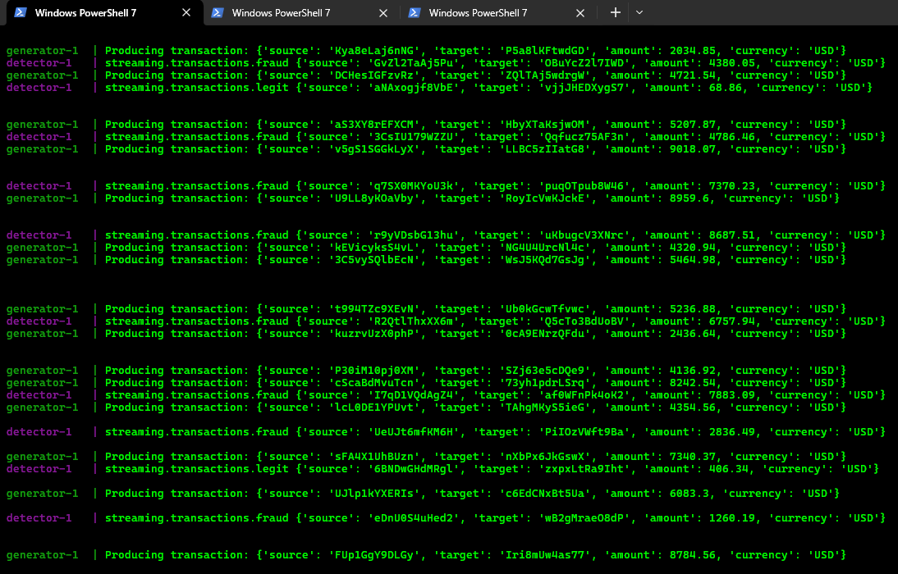
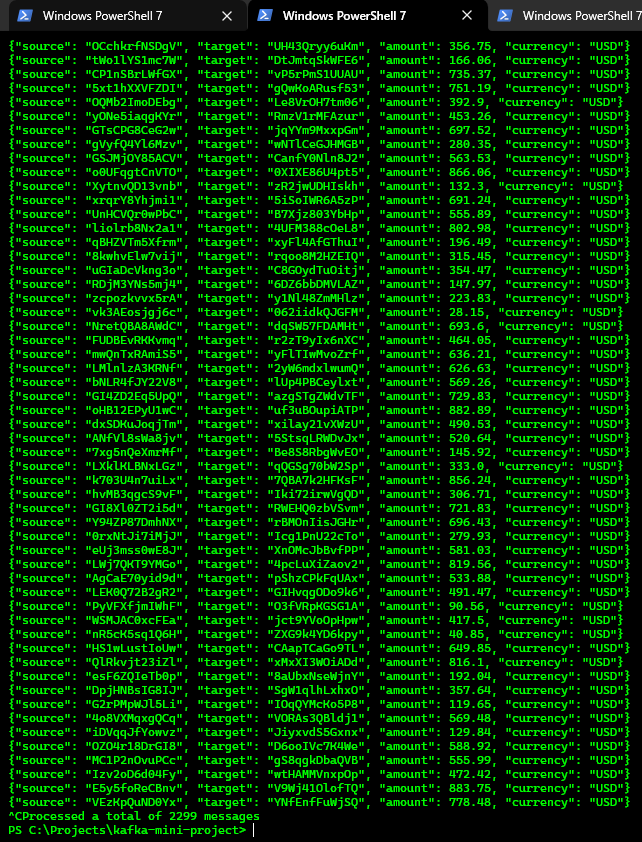
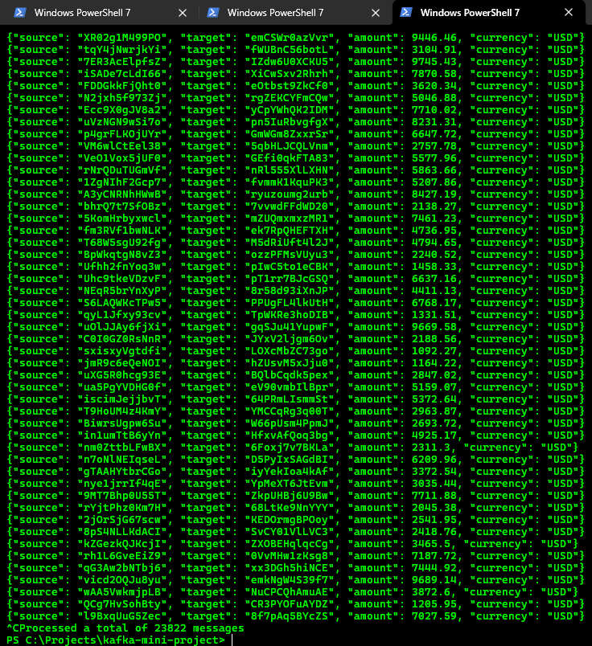

# Kafka Mini Project

This project implements a real-time fraud detection pipeline using **Apache Kafka** and **Python**. It simulates transaction data, processes it through a fraud detection logic, and routes legitimate and suspicious transactions to separate Kafka topics.

This README documents the successful completion of a Kafka-based mini project that meets all functional requirements, including real-time data simulation, processing, and classification.

## Overview

- **Kafka Broker & Zookeeper**: Message streaming backbone.
- **Generator**: Produces simulated transaction data at a fixed rate.
- **Detector**: Consumes transactions and applies fraud detection rules.
- **Topics**:
  - `queueing.transactions`: Input topic for raw transactions
  - `streaming.transactions.legit`: For legitimate transactions
  - `streaming.transactions.fraud`: For flagged transactions

## How to Run

### Step 1: Clean and Build

```powershell
# Optional: remove old volumes/data
rm -rf kafka-data zookeeper-data

# Build all services from scratch
docker compose build --no-cache
```

### Step 2: Start All Services

```powershell
docker compose up
```

This will:

- Start Zookeeper and Kafka broker
- Launch the generator and detector

## Demonstration of Functionality

### ✅ All Services Running

The generator container produces transaction messages to the `queueing.transactions` Kafka topic.

#### Screenshot: Docker containers running successfully



#### Screenshot: Generator and Detector Console Output



Transactions over $900 are classified as fraudulent and sent to the `streaming.transactions.fraud` topic. All others are considered legitimate and sent to `streaming.transactions.legit`.

This command shows legitimate transactions from Kafka:

```powershell
docker exec -it kafka-mini-project-broker-1 kafka-console-consumer \
  --bootstrap-server broker:9092 \
  --topic streaming.transactions.legit \
  --from-beginning
```

#### Screenshot: Legitimate Transactions from Kafka Topic



This Docker commands provides us our "fraud" transactions:

```powershell
docker exec -it kafka-mini-project-broker-1 kafka-console-consumer \
  --bootstrap-server broker:9092 \
  --topic streaming.transactions.fraud \
  --from-beginning
```

#### Screenshot: Fraudulent Transactions from Kafka Topic



## Kafka Topics

You can use these command to inspect messages:

### Fraud

```bash
docker exec -it kafka-mini-project-broker-1 kafka-console-consumer \
  --bootstrap-server broker:9092 \
  --topic streaming.transactions.fraud \
  --from-beginning
```

### Legit

```
docker exec -it kafka-mini-project-broker-1 kafka-console-consumer \
  --bootstrap-server broker:9092 \
  --topic streaming.transactions.legit \
  --from-beginning
```

## Troubleshooting Notes

- `depends_on.condition: service_healthy` used for reliable container startup
- Health checks for Zookeeper and Kafka are critical to avoid startup races
- Rebuild images with `--no-cache` to ensure updates are applied
- Use `docker compose down -v` to remove all state if cluster ID issues arise

## Notes

- No volumes are required for functionality; logs were intended for optional performance analysis
- Screenshots were captured after services were verified working
